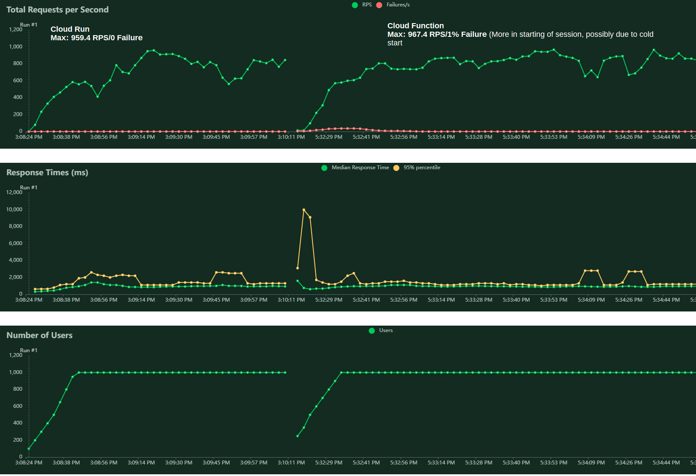

# Run vs Fun
A simple exercise learning
  - [x] How to deploy a simple `python fastapi` webapp using
    - [x] Google Cloud Run
    - [x] Google Cloud Functions
    - [ ] Google App Engine
  - [x] How to use the Google Cloud SDK
  - [x] How to use the Google Cloud CLI
  - [x] Comparison of the two services wrt load test
  - [x] Comparison of different docker base images


---
<br>

# Loadtest results
1. Using [locust](https://locust.io/)

    <!--  -->

2. Using `hey`
    - Cloud Function

      ```bash
      ```

    - Cloud Run

      ```bash
      https://{URL}/api/users

      Summary:
        Total:        6.8062 secs
        Slowest:      3.7022 secs
        Fastest:      0.2459 secs
        Average:      0.5475 secs
        Requests/sec: 1469.2505
        
        Total data:   960000 bytes
        Size/request: 96 bytes

      Response time histogram:
        0.246 [1]     |
        0.592 [7814]  |■■■■■■■■■■■■■■■■■■■■■■■■■■■■■■■■■■■■■■■■
        0.937 [879]   |■■■■
        1.283 [606]   |■■■
        1.628 [456]   |■■
        1.974 [150]   |■
        2.320 [61]    |
        2.665 [22]    |
        3.011 [2]     |
        3.357 [1]     |
        3.702 [8]     |


      Latency distribution:
        10% in 0.3003 secs
        25% in 0.3272 secs
        50% in 0.3791 secs
        75% in 0.5586 secs
        90% in 1.0997 secs
        95% in 1.4101 secs
        99% in 1.9517 secs

      Details (average, fastest, slowest):
        DNS+dialup:   0.0332 secs, 0.2459 secs, 3.7022 secs
        DNS-lookup:   0.0151 secs, 0.0000 secs, 0.3593 secs
        req write:    0.0001 secs, 0.0000 secs, 0.0773 secs
        resp wait:    0.4294 secs, 0.2458 secs, 2.5567 secs
        resp read:    0.0001 secs, 0.0000 secs, 0.0222 secs

      Status code distribution:
        [200] 10000 responses
      ```

---
## Image Comparisons

### Size?
|  Config       | No Alpine | Alpine   |
|---------------|-----------|----------|
| No Distroless |  1GB      | 147.56 MB|

